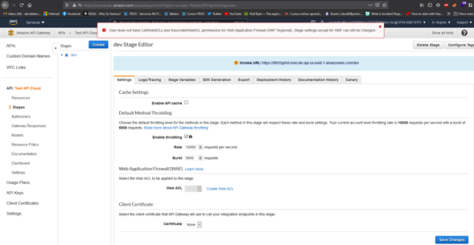
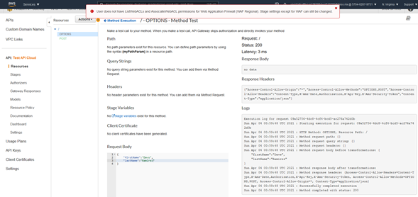
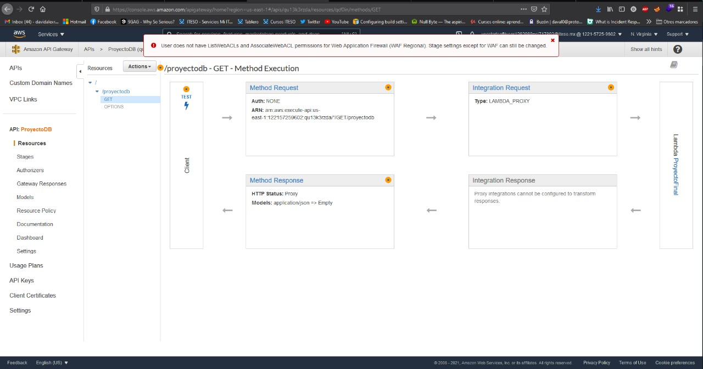

- Descripción del micro-servicio: 
Dar mantenimient, monitoreo y la proteccion de API . 

- Requerimientos funcionales:
Amplify , Lambda 

- Requerimientos no funcionales:
Plataforma accesible 24 hrs , Mantenimiento programado 

- URL de despliegue: Invoke URL: https://kf935jpi0d.execute-api.us-east-1.amazonaws.com/dev .

Despliegue de Amazon API Gateway

Validacion de la API (codigo 200) , ahorita solo acepta el nombre del usuario . 

Dentro de la API se configuro un recurso llamado proyectoDB , y se configuro un metodo GET , para que haga un escaneo de la base de datos conectado a lambda para finalizar la consulta . 

