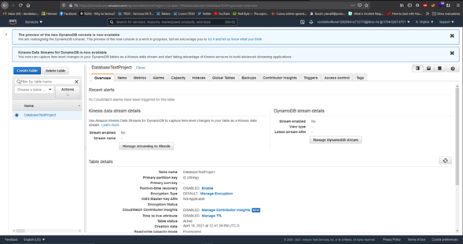

- Descripción del micro-servicio: 
Base datos propia de AWS 

- Requerimientos funcionales:
Guardar informacion , sincronizacion con pagina web , Aseguramiento de datos 

- Requerimientos no funcionales:
Actualizaciones , orden de datos 

- URL de despliegue: arn:aws:dynamodb:us-east-1:570462879751:table/DatabaseTestProject

Se creo una base de datos con Nombre: DatabaseTestProject , se agregaron los permisos necesarios para modificar desde lambda . 

# Tabla Final de DB 

