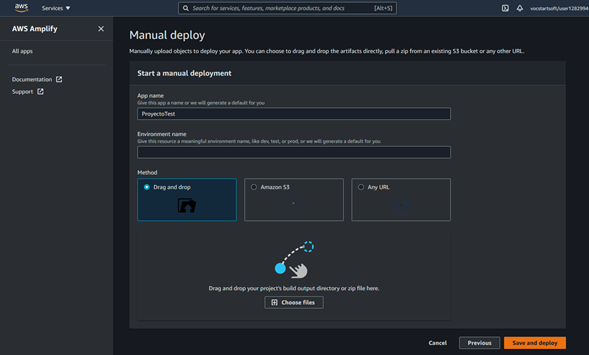

- Descripción del micro-servicio: 
Alojamiento web estatico 

- Requerimientos funcionales:
Backend , Front End y Bulk 

- Requerimientos no funcionales:
Actualizaciones compatiblidadad 

- URL de despliegue: https://dev.d22hs3f0s46sr4.amplifyapp.com/.

Se uso la consola de AWS Amplify para implementar los recursos estaticos de una aplicacion web , por el momento se tiene solamente un Hello world de prueba.

Despliegue de Amplify :

