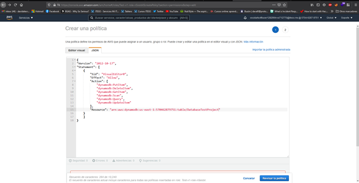

- Descripción del micro-servicio: 
Control de Accesos mediante roles y permisos 

- Requerimientos funcionales:
Configurable , seguro y control total 

- Requerimientos no funcionales:
Actualizaciones 

- URL de despliegue: (por lo pronto dejar en blanco).

Se creo un ROL para maneajar los datos de la base de Datos en DynamoDB desde la funcion LAMBDA . De esta manera ya se tiene permisos para escribir en la base de datos desde la aplicacion web 

Se creo una politica especial llamada readDB y se le asigno a un rol READB

