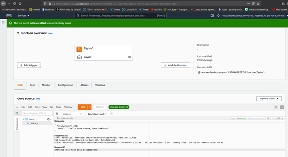
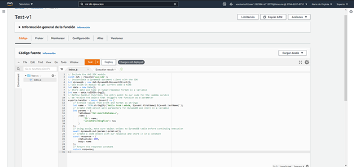

- Descripción del micro-servicio: 
Pemite ejecutar codigo , sin servidores 

- Requerimientos funcionales:
Funcionamiento continuo , sin parar

- Requerimientos no funcionales:
Actualizaciones compatiblidadad

- URL de despliegue: arn:aws:lambda:us-east-1:570462879751:function:Test-v1

Validacion de LAMBDA fase 1 : 

Se agregaron los permisos para modificar tabla de datos con codigo propio de AWS para realizar la conexion desde lambda pero con permisos IAM 

Codigo en Json :

{
"Version": "2012-10-17",
"Statement": [
    {
        "Sid": "VisualEditor0",
        "Effect": "Allow",
        "Action": [
            "dynamodb:PutItem",
            "dynamodb:DeleteItem",
            "dynamodb:GetItem",
            "dynamodb:Scan",
            "dynamodb:Query",
            "dynamodb:UpdateItem"
        ],
        "Resource": "arn:aws:dynamodb:us-east-1:570462879751:table/DatabaseTestProject"
    }
    ]
}

A la funcion Lambda se le agrego codigo en js para escribir en la tabla DynamoDB : 

Codigo : 

// Include the AWS SDK module
const AWS = require('aws-sdk');
// Instantiate a DynamoDB document client with the SDK
let dynamodb = new AWS.DynamoDB.DocumentClient();
// Use built-in module to get current date & time
let date = new Date();
// Store date and time in human-readable format in a variable
let now = date.toISOString();
// Define handler function, the entry point to our code for the Lambda service
// We receive the object that triggers the function as a parameter
exports.handler = async (event) => {
    // Extract values from event and format as strings
    let name = JSON.stringify(`Hello from Lambda, ${event.firstName} ${event.lastName}`);
    // Create JSON object with parameters for DynamoDB and store in a variable
    let params = {
        TableName:'HelloWorldDatabase',
        Item: {
            'ID': name,
            'LatestGreetingTime': now
        }
    };
    // Using await, make sure object writes to DynamoDB table before continuing execution
    await dynamodb.put(params).promise();
    // Create a JSON object with our response and store it in a constant
    const response = {
        statusCode: 200,
        body: name
    };
    // Return the response constant
    return response;
};

Capturas : 

