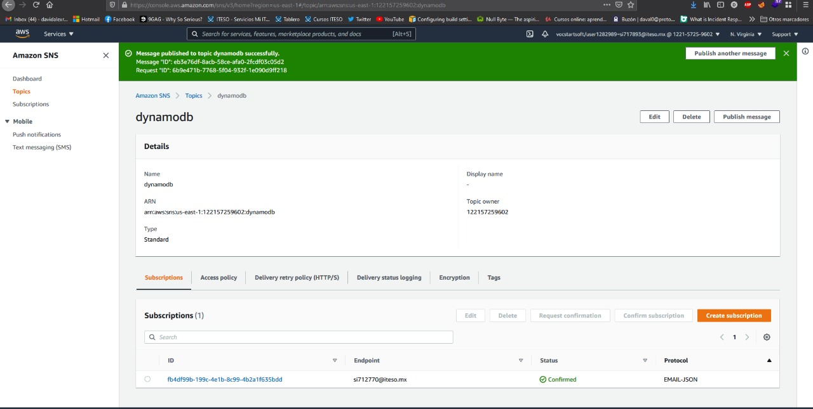

- Descripción del micro-servicio: 
Alarmas y notificaciones de correo SMS mensajeria y movil 

- Requerimientos funcionales:
Alarmas generales , categorizacion , isntantaneo , continuo 

- Requerimientos no funcionales:
Actualizaciones configuracion de encabezados 

- URL de despliegue: 

SNS con alarmas para nuevos productos de DynamoDB

