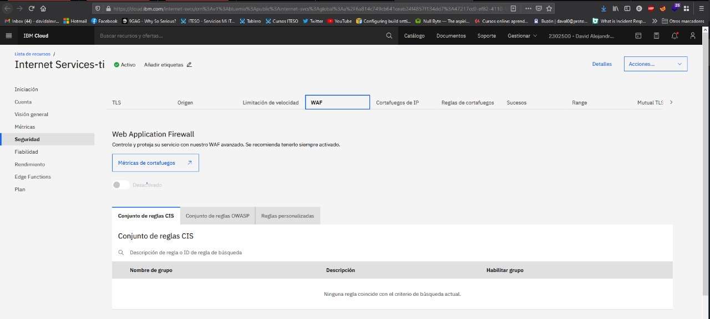

- Descripción del micro-servicio: 
Web application Firewall , proteccion de amenazas web 

- Requerimientos funcionales:
Proteccion contras OWASP tOP 10 , compatiblidadad , sincronizacion , adaptabilidad 

- Requerimientos no funcionales:
Actualziaciones 

La configuracion de WAF se complico debido a que no tenemos acceso al dominio pero las configuraciones y el servicio esta activo . 

